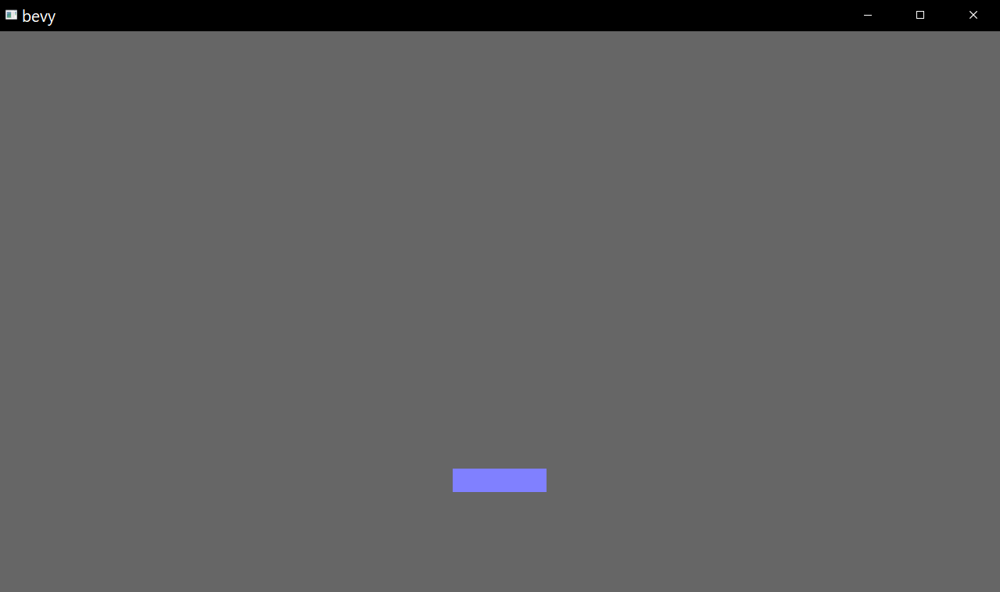

# Breakout Clone
Bevy comes with it a series of [helpful examples](https://github.com/bevyengine/bevy/blob/latest/examples). One of these is a [breakout clone](https://github.com/bevyengine/bevy/blob/latest/examples/game/breakout.rs), but the problem is - I need to break it down into chunks for me to learn. This is an attempt to do this in a tutorial style.

# Assumptions
This assumes some knowledge with Rust, and won't go into the language itself, but only with Bevy and creating a Breakout-style game

# Start the Project
First, bootstrap a new project (`cargo new breakout`) add to your `Cargo.toml` in the main directory, the following line:

```toml
[dependencies]
bevy = "0.5.0"
```
and run
```bash
cargo run
```
to download and run. See [here](https://bevyengine.org/learn/book/getting-started/setup/) for more information on fast compilation, which makes your life much easier.

# Starting the app
This is the obligatory "hello, world" section of this document. Without the "hello, world". Open `src/main.rs` and add to the top of the file
```rust
use bevy::prelude::*;
```
and replace the main function with 
```rust
fn main() {
    App::build().add_plugins(DefaultPlugins).run();
}
```
and you have a Bevy Application! Of course, it doesn't do anything but registers all the good stuff from Bevy (via `DefaultPlugins` being registered). 

# What is Breakout?
If you don't know what [Breakout](https://en.wikipedia.org/wiki/Breakout_(video_game)) is, it consists of a paddle at the bottom whacking a ball upwards into a series of blocks. When they collide, the block dissapears and points are added. Simple, right?

There are a whole bunch of components for us to model:
- The `Scoreboard` -> keeping track of how many blocks we've pwned
- The `Ball`
- The `Paddle` -> the object you will control
  
Bevy uses `ECS` or `Entity Component Systems`, as well as `Resources` to efficiently managing all the business of running a game. To be honest, these are concepts I'm still grokking, but hopefully through their use we will learn more about them.

# Intial _things_
As mentioned above, we know we're going to need `Scoreboard`, `Ball` and `Paddle` _things_, which are usually plain 'ol Rust structs:

```rust
struct Scoreboard {
    score: usize,
}

struct Ball {
    velocity: Vec3,
}

struct Paddle {
    speed: f32,
}
```

# Setup
Passing off logic and do-ey stuff to `systems` (the `S` in `ECS`) is the name of the game. Let's start with a `setup()` system where we'll create a camera, and initialise the entities above.

```rust
fn setup() {
    mut commands: Commands,
    mut materials: ResMut<Assets<ColorMaterial>>,
    asset_server: Res<AssetServer>,
} {

}
```
To create things in Bevy, we issue commands using the commands object. When we initialise the system (which we will shortly), the arguments we specify in the function will be filled automatically with Bevy. Here, we have `commands`, as well as two resources `Res` for immutable and `ResMut` for mutable.

So this function is saying to Bevy "give me commands, I want the assets (materials) and I'm going to change it, and I want to read the asset server as well".

Now, let's add the paddle, add a (2d) camera, a UI camera:

```rust
fn setup() {
    mut commands: Commands,
    mut materials: ResMut<Assets<ColorMaterial>>,
    asset_server: Res<AssetServer>,
} {
    // Add the game's entities to our world

    // cameras
    commands.spawn_bundle(OrthographicCameraBundle::new_2d());
    commands.spawn_bundle(UiCameraBundle::default());
    // paddle
    commands
        .spawn_bundle(SpriteBundle {
            material: materials.add(Color::rgb(0.5,0.5,1.0).into()),
            transform: Transform::from_xyz(0.0, -215.0, 0.0),
            sprite: Sprite::new(Vec2::new(120.0, 30.0)),
            ..Default::default()
        });
}
```
and replace the contents of `main`:

```rust
    App::build()
        .add_plugins(DefaultPlugins)
        .add_startup_system(setup.system())
        .run();
```
and give it a run. And you get this awesomeness:

Yay, we did that!
# Resources
That grey background doesn't do it for me, so let's fix that now by inserting a resource to make it clear:

```rust
    App::build()
        .add_plugins(DefaultPlugins)
        .insert_resource(ClearColor(Color::rgb(0.9, 0.9, 0.9)))
        .add_startup_system(setup.system())
        .run();
```
`ClearColor` is a resource provided by Bevy, which is magically handled to turn off that hideous grey. Now, we want to tag each of our components so we can tell what they are later, and to do this, we'll create an `enum` which tells us the type of object it is:

```rust
enum Collider {
    Solid,
    Scorable,
    Paddle,
}
```
So walls will be solid, scoreable will be the blocks we're going to smash and the paddle is... the paddle. Let's add this tag to our bundle we just spawned, along with the Paddle struct we created earlier

```rust
[...]

    commands.spawn_bundle(SpriteBundle {
        material: materials.add(Color::rgb(0.5, 0.5, 1.0).into()),
        transform: Transform::from_xyz(0.0, -215.0, 0.0),
        sprite: Sprite::new(Vec2::new(120.0, 30.0)),
        ..Default::default()
    })
    .insert(Paddle { speed: 500.0 })
    .insert(Collider::Paddle)
    ;
```
# It's alive!
Now it's time to make it so we can move it around, and which do you use to do do-ey things? Systems! This is another system besides the setup one, so it will be another function which takes 3 arguments:

```rust
fn paddle_movement_system(
    time: Res<Time>,
    keyboard_input: Res<Input<KeyCode>>,
    mut query: Query<(&Paddle, &mut Transform)>,
)
{

}
```
We need to know how long it's been since the last pass (`Res<Time>`), the inputs on the keyboard (`Res<Input<KeyCode>>`) and we want the `Paddle`, along with it's `Transform`, which is given as part of the [`SpriteBundle`](https://docs.rs/bevy/0.5.0/bevy/prelude/struct.SpriteBundle.html) that we used. 

```rust
fn paddle_movement_system(
    time: Res<Time>,
    keyboard_input: Res<Input<KeyCode>>,
    mut query: Query<(&Paddle, &mut Transform)>,
)
{
    if let Ok((paddle, mut transform)) = query.single_mut() {
        let mut direction = 0.0;
        if keyboard_input.pressed(KeyCode::Left) {
            direction -= 1.0;
        }

        if keyboard_input.pressed(KeyCode::Right) {
            direction += 1.0;
        }

        let translation = &mut transform.translation;
        // move the paddle horizontally
        translation.x += time.delta_seconds() * direction * paddle.speed;
        // bound the paddle within the walls
        translation.x = translation.x.min(380.0).max(-380.0);
    }
}
```
Here, we take a `single_mut()` of the query, as we know there is only one paddle, and we want it to be mutable. After initialising the direction, we check to see if the `KeyCode::Left` or `KeyCode::Right` - the arrow keys - have been pressed, and change the direction accordingly.

## Why do we take a mutable reference?
We do something interesting to work with the borrow checker, we take a mutable reference to the translation element of the transform struct, for us to mutate. If you tried to change the translation element directly
```rust
        // move the paddle horizontally
        transform.translation.x += time.delta_seconds() * direction * paddle.speed;
        // bound the paddle within the walls
        transform.translation.x = translation.x.min(380.0).max(-380.0);
```
you'd get this helpful error from the compiler:
```bash
error: cannot borrow `transform` as mutable more than once at a time
first mutable borrow occurs here
if let Ok((paddle, mut transform)) = query.single_mut(){}
```
Couldn't have said it better myself.

Finally, we clamp the value to the interval [-380.0, 380].

Finally, add it as a system. We previously used `add_startup_system` which only runs once, whereas this one we want polling all the time via `add_system`:
```rust
fn main() {
[...]
    .add_startup_system(setup.system())
    .add_system(paddle_movement_system.system())
    .run();
}
```
Give it a bash now - and it moves! It's alive!! You'll notice that there is a gutter - that will be for the walls later.

# Having a ball
Time to get that ball going. You know the drill. Nothing new here, put this under the paddle:

```rust
fn setup(
[...]
commands
    .spawn_bundle(SpriteBundle {
        material: materials.add(Color::rgb(1.0, 0.5, 0.5).into()),
        transform: Transform::from_xyz(0.0, -50.0, 1.0),
        sprite: Sprite::new(Vec2::new(30.0, 30.0)),
        ..Default::default()
    })
    .insert(Ball {velocity: 400.0 * Vec3::new(0.5, -0.5, 0.0).normalize(),
    });
```
Of course, it doesn't do anything yet. Let's add a system to control it's movement. Same drill, the parameters will be injected by Bevy - `Time` and the `Ball` along with it's `Transform`

```rust
fn ball_movement_system(time: Res<Time>, mut ball_query: Query<(&Ball, &mut Transform)>) {
    // clamp the timestep to stop the ball from escaping when the game starts
    let delta_seconds = f32::min(0.2, time.delta_seconds());

    if let Ok((ball, mut transform)) = ball_query.single_mut() {
        transform.translation += ball.velocity * delta_seconds;
    }
}
```
If you try and change to using `time.delta_seconds()` without minimising to 0.2, you'll notice you don't have a chance to get the ball.

Same as before, we know there is only one ball, so we'll apply the fraction of the velocity, just like with the paddle. Now we're getting somewhere.


